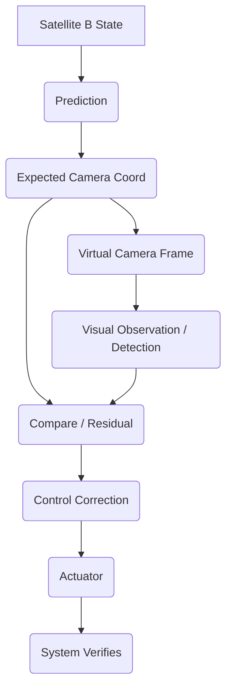

# PAT System Flow

The core flow executed by the simulation engine in `simulation_engine.py`:

1. **PREDICT**: The system estimates where the target will be.
2. **OBSERVE**: The virtual camera captures the scene.
3. **COMPARE**: The vision system calculates the pixel difference (residual) between the predicted target and the actual detected target.
4. **CORRECT**: The controller calculates a pan/tilt command to minimize the residual.
5. **VERIFY / TRACK / RECOVER**: The PAT manager transitions states based on confidence.
